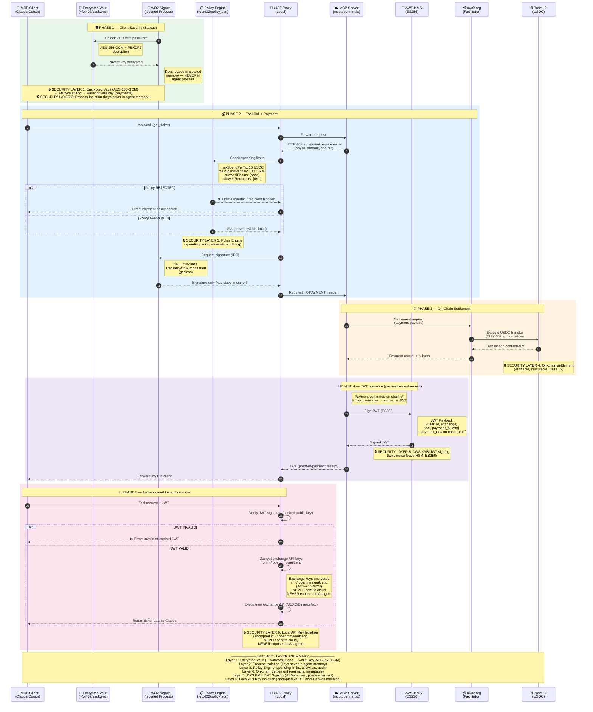

# @qbtlabs/x402

Multi-chain payment protocol for AI agents. Enable pay-per-call monetization for MCP servers with automatic stablecoin micropayments across EVM, Solana, and Cardano.

[](https://www.npmjs.com/package/@qbtlabs/x402)
[](https://www.npmjs.com/package/@qbtlabs/x402)
[](https://opensource.org/licenses/MIT)

## Supported Chains

| Chain | Token(s) | Pattern | Network |
|-------|----------|---------|---------|
| **Base (EVM)** | USDC | EIP-3009 (gasless) | Mainnet / Sepolia |
| **Solana** | USDC | PST (gasless via facilitator) | Mainnet / Devnet |
| **Cardano** | ADA, iUSD, USDM, DJED, USDCx | Signed tx via Lucid | Mainnet / Preprod |

## Architecture

The x402 payment system uses a secure 6-layer architecture with process isolation:



### 6 Security Layers

| Layer | Component | Protection |
|-------|-----------|------------|
| **1. Encrypted Vault** | `~/.x402/vault.enc` | Wallet key encrypted at rest (AES-256-GCM + PBKDF2) |
| **2. Process Isolation** | `x402-signer` | Keys never enter AI agent process memory |
| **3. Policy Engine** | `~/.x402/policy.json` | Spending limits, allowlists, audit logging |
| **4. On-chain Settlement** | Base L2 | Verifiable, immutable USDC transfers |
| **5. AWS KMS JWT** | ES256 signing | Server keys never leave HSM |
| **6. Local API Keys** | `~/.openmm/vault.enc` | Exchange credentials encrypted, never sent to cloud |

### Two Vaults

| Vault | Path | Contents |
|-------|------|----------|
| **x402 Vault** | `~/.x402/vault.enc` | Wallet private key (for payments) |
| **OpenMM Vault** | `~/.openmm/vault.enc` | Exchange API keys (for trading) |

Both use AES-256-GCM encryption with PBKDF2 key derivation.

## Security Architecture (v0.4.0+)

Private keys should never be exposed to AI agents. The x402 security layer provides three protection mechanisms:

```
┌───────────────────────────┐     ┌───────────────────────────┐
│    AI AGENT PROCESS       │     │    x402-signer PROCESS    │
│                           │     │    (isolated)             │
│  ┌─────────────────────┐ │     │  ┌─────────────────────┐  │
│  │ AI Agent (Claude)   │ │     │  │ Encrypted Vault     │  │
│  │                     │ │     │  │ ~/.x402/vault.enc   │  │
│  │ NO KEY ACCESS       │ │     │  │ (AES-256-GCM)       │  │
│  └──────────┬──────────┘ │     │  └──────────┬──────────┘  │
│             │            │     │             │              │
│  ┌──────────▼──────────┐ │     │  ┌──────────▼──────────┐  │
│  │ x402 Client Proxy   │ │     │  │ Policy Engine       │  │
│  │                     │◄┼─────┼─►│ - Max per tx        │  │
│  │ Forwards sign reqs  │ │ IPC │  │ - Max per day       │  │
│  └─────────────────────┘ │     │  │ - Allowed addresses │  │
│                          │     │  └──────────┬──────────┘  │
└──────────────────────────┘     │             │              │
                                 │  ┌──────────▼──────────┐  │
                                 │  │ Sign → Wipe Memory  │  │
                                 │  └─────────────────────┘  │
                                 └───────────────────────────┘
```

### Security Layers

| Layer | Component | Protection |
|-------|-----------|------------|
| **Encrypted Vault** | `~/.x402/vault.enc` | Keys encrypted at rest (AES-256-GCM, PBKDF2) |
| **Process Isolation** | `x402-signer` | Keys never enter AI agent process |
| **Policy Engine** | `~/.x402/policy.json` | Spending limits, allowlists, audit log |

### Vault CLI

```bash
# Initialize new vault (generates key)
x402 vault init

# Import existing key
x402 vault import
x402 vault import --from-env X402_PRIVATE_KEY

# Show wallet address (no decryption needed)
x402 vault address

# Change password
x402 vault passwd
```

### Policy Configuration

```json
// ~/.x402/policy.json
{
  "rules": {
    "maxSpendPerTx": { "amount": "10", "currency": "USDC" },
    "maxSpendPerDay": { "amount": "100", "currency": "USDC" },
    "allowedChains": ["base"],
    "allowedRecipients": ["0xfacilitator..."]
  },
  "audit": {
    "enabled": true,
    "logFile": "~/.x402/audit.log"
  }
}
```

### Policy CLI

```bash
# View current policy
x402 policy show

# Set spending limits
x402 policy set maxSpendPerTx 10 USDC
x402 policy set maxSpendPerDay 100 USDC

# View spending history
x402 policy spending
x402 policy spending --week

# View audit log
x402 policy audit
```

## Features

- **Multi-Client Support** — Works with Claude Code, Claude Desktop, Cursor, Windsurf, and any MCP client
- **Client Proxy** — Automatic payment signing via stdio transport
- **Server Middleware** — Payment gating with zero tool-level changes
- **Payment-Aware Fetch** — Drop-in replacement for `fetch()` with payment handling
- **Multi-Chain** — Base (EVM), Solana, and Cardano with unified API
- **Gasless Payments** — Users don't need native tokens for gas (EVM via EIP-3009, Solana via facilitator fee payer)
- **Multi-Token (Cardano)** — Accept ADA or stablecoins: iUSD, USDM, DJED, USDCx
- **Testnet Ready** — Base Sepolia, Solana Devnet, Cardano Preprod

## Installation

```bash
npm install @qbtlabs/x402
```

## Quick Start: Client Side

x402 works with any MCP client that supports stdio transport. Configure your preferred client below:

### Claude Code

Add to `~/.claude.json` (or `~/.claude/mcp_servers.json`):

```json
{
  "mcpServers": {
    "openmm": {
      "command": "npx",
      "args": ["@qbtlabs/x402", "client-proxy", "--target", "https://mcp.openmm.io/mcp"],
      "env": {
        "X402_PRIVATE_KEY": "0xYOUR_PRIVATE_KEY"
      }
    }
  }
}
```

### Claude Desktop

Add to your Claude Desktop config:

**macOS:** `~/Library/Application Support/Claude/claude_desktop_config.json`  
**Windows:** `%APPDATA%\Claude\claude_desktop_config.json`  
**Linux:** `~/.config/Claude/claude_desktop_config.json`

```json
{
  "mcpServers": {
    "openmm": {
      "command": "npx",
      "args": ["@qbtlabs/x402", "client-proxy", "--target", "https://mcp.openmm.io/mcp"],
      "env": {
        "X402_PRIVATE_KEY": "0xYOUR_PRIVATE_KEY"
      }
    }
  }
}
```

### Cursor

Add to `.cursor/mcp.json` in your workspace (or `~/.cursor/mcp.json` for global):

```json
{
  "mcpServers": {
    "openmm": {
      "command": "npx",
      "args": ["@qbtlabs/x402", "client-proxy", "--target", "https://mcp.openmm.io/mcp"],
      "env": {
        "X402_PRIVATE_KEY": "0xYOUR_PRIVATE_KEY"
      }
    }
  }
}
```

### Windsurf

Add to `~/.codeium/windsurf/mcp_config.json`:

```json
{
  "mcpServers": {
    "openmm": {
      "command": "npx",
      "args": ["@qbtlabs/x402", "client-proxy", "--target", "https://mcp.openmm.io/mcp"],
      "env": {
        "X402_PRIVATE_KEY": "0xYOUR_PRIVATE_KEY"
      }
    }
  }
}
```

### Any MCP Client

The x402 proxy uses stdio transport, so it works with any MCP-compatible client. The configuration pattern is the same — just point your client to `npx @qbtlabs/x402 client-proxy`.

That's it! Your AI agent will now automatically pay for tool calls.

### Programmatic Client Usage

```typescript
import { createPaymentFetch } from '@qbtlabs/x402';

// Create a payment-aware fetch function
const paymentFetch = createPaymentFetch({
  privateKey: process.env.X402_PRIVATE_KEY,
  chainId: 84532, // Base Sepolia
});

// Use like regular fetch — payments happen automatically
const response = await paymentFetch('https://mcp.openmm.io/mcp', {
  method: 'POST',
  headers: { 'Content-Type': 'application/json' },
  body: JSON.stringify({
    jsonrpc: '2.0',
    method: 'tools/call',
    params: { name: 'get_ticker', arguments: { exchange: 'mexc', symbol: 'BTC/USDT' } },
    id: 1,
  }),
});
```

## Quick Start: Server Side

### Cloudflare Worker with x402

```typescript
import { withX402Server, setToolPrices, configure } from '@qbtlabs/x402';

// Configure payment recipients (multi-chain)
configure({
  evm: { address: process.env.X402_EVM_ADDRESS },
  solana: { address: process.env.X402_SOLANA_ADDRESS },
  cardano: { address: process.env.X402_CARDANO_ADDRESS },
  testnet: process.env.X402_TESTNET === 'true',
});

// Set tool pricing
setToolPrices({
  list_exchanges: 'free',
  get_ticker: 'read',      // $0.001
  get_orderbook: 'read',   // $0.001
  place_order: 'write',    // $0.01
});

// Your MCP request handler
async function handleMcpRequest(request: Request): Promise<Response> {
  const body = await request.json();
  // ... handle MCP JSON-RPC
  return Response.json({ jsonrpc: '2.0', id: body.id, result: { /* ... */ } });
}

// Wrap with x402 payment gating
export default {
  fetch: withX402Server({
    handler: handleMcpRequest,
  }),
};
```

The middleware automatically:
- Passes free tools and non-tool requests through
- Returns 402 with payment requirements for all configured chains
- Verifies payments via the appropriate facilitator (x402.org for EVM, PayAI for Solana)
- Settles payments after successful execution

## API Reference

### Configuration

```typescript
import { configure, setToolPrices, getActiveChains } from '@qbtlabs/x402';

// Configure payment settings (multi-chain)
configure({
  evm: { address: '0x...' },             // Base USDC receiving address
  solana: { address: 'So...' },          // Solana USDC receiving address
  cardano: { address: 'addr1q...' },     // Cardano receiving address
  testnet: true,                          // Use testnets (Sepolia, Devnet, Preprod)
  facilitatorUrl: 'https://x402.org',    // EVM facilitator
  solanaFacilitatorUrl: 'https://facilitator.payai.network', // Solana facilitator
});

// Check which chains are configured
const chains = getActiveChains();
// ['eip155:84532', 'solana:EtWTRABZaYq6iMfeYKouRu166VU2xqa1', 'cardano:preprod']

// Set pricing for tools
setToolPrices({
  'tool_name': 'free',      // $0
  'tool_name': 'read',      // $0.001
  'tool_name': 'analysis',  // $0.005
  'tool_name': 'write',     // $0.01
  'tool_name': 0.05,        // Custom price in USD
});
```

### Transport Layer

#### `createPaymentFetch(options)`

Creates a fetch function that automatically handles 402 responses.

```typescript
import { createPaymentFetch } from '@qbtlabs/x402';

const paymentFetch = createPaymentFetch({
  privateKey: '0x...',    // Wallet private key
  chainId: 84532,         // Chain ID (84532 = Base Sepolia, 8453 = Base)
});

const response = await paymentFetch(url, options);
```

#### `withX402Server(options)`

Middleware that wraps a request handler with payment gating.

```typescript
import { withX402Server } from '@qbtlabs/x402';

const handler = withX402Server({
  handler: async (request: Request) => Response,
  extractToolName: (body: unknown) => string | null,  // Optional custom extractor
});
```

### Proxy Layer

#### `createClientProxy(options)`

Creates a stdio-to-HTTP proxy with payment handling.

```typescript
import { createClientProxy } from '@qbtlabs/x402';

const proxy = createClientProxy({
  targetUrl: 'https://mcp.openmm.io/mcp',
  privateKey: '0x...',
  chainId: 84532,
});

await proxy.start();
```

#### `createPassthroughProxy(options)`

Creates a full MCP passthrough proxy.

```typescript
import { createPassthroughProxy } from '@qbtlabs/x402';

await createPassthroughProxy({
  targetUrl: 'https://mcp.openmm.io/mcp',
  privateKey: '0x...',
  mode: 'stdio',
});
```

### Client Utilities

```typescript
import { signPayment, buildPaymentPayload, parsePaymentRequired } from '@qbtlabs/x402';

// Parse 402 response
const requirements = parsePaymentRequired(response);

// Sign a payment
const signature = await signPayment({
  privateKey: '0x...',
  to: requirements.payTo,
  value: requirements.maxAmountRequired,
  chainId: 84532,
});

// Build the X-PAYMENT header value
const paymentHeader = buildPaymentPayload(signature, requirements);
```

### Facilitator Integration

```typescript
import {
  buildFacilitatorRequirements,
  verifyWithFacilitator,
  settleWithFacilitator,
} from '@qbtlabs/x402';

// Build 402 response requirements
const requirements = buildFacilitatorRequirements('get_ticker');

// Verify a payment
const result = await verifyWithFacilitator(paymentPayload, 'get_ticker');

// Settle after execution
await settleWithFacilitator(paymentPayload, 'get_ticker');
```

### Solana Adapter

The Solana adapter uses a **Partially Signed Transaction (PST)** pattern. The user signs a transfer, and the facilitator adds its signature as fee payer — making payments **gasless** for the user.

```typescript
import { solana } from '@qbtlabs/x402';

// Client: Sign a USDC payment (gasless — facilitator pays SOL fees)
const payload = await solana.signSolanaPayment({
  privateKey: keypair.secretKey,        // 64-byte Solana keypair
  to: 'MerchantPubkey...',              // USDC recipient
  amount: 0.01,                          // USD amount
  network: 'solana:5eykt4UsFv8P8NJdTREpY1vzqKqZKvdp',  // mainnet
  feePayer: '2wKupLR9q6wXYppw...',      // facilitator fee payer (from 402 response)
});

// Server: Verify payment structure (no network calls)
const result = await solana.verifyPayment(
  payload,
  0.01,                                  // expected USD amount
  'solana:5eykt4UsFv8P8NJdTREpY1vzqKqZKvdp',
);
// { valid: true, payer: 'ClientPubkey...' }
```

**Instruction layout** (strict order per x402 spec):
1. `SetComputeUnitLimit` — compute budget
2. `SetComputeUnitPrice` — priority fee (≤5M microlamports)
3. `TransferChecked` — USDC transfer
4. `Memo` — 16-byte nonce for replay protection

### Cardano Adapter

The Cardano adapter uses **Lucid Evolution** for client-side transaction building and **CML** for server-side verification. Supports ADA and multiple stablecoins.

```typescript
import { cardano } from '@qbtlabs/x402';

// Client: Sign a payment (iUSD example)
const payload = await cardano.signCardanoPayment({
  seed: 'word1 word2 ... word24',       // BIP-39 mnemonic
  toAddress: 'addr1q...',               // merchant address
  amount: 10_000n,                       // 0.01 iUSD (6 decimals)
  token: 'iUSD',                         // ADA | iUSD | USDM | DJED | USDCx
  blockfrostProjectId: 'mainnetXXX',
  network: 'Mainnet',                    // or 'Preprod'
});
// { transaction: 'hex-cbor-signed-tx' }

// Server: Verify payment structure
const result = await cardano.verifyCardanoPayment(
  payload,
  'addr1q...',                           // expected recipient
  10_000n,                               // expected amount
  'iUSD',                                // expected token
);
// { valid: true }

// Settlement: Submit via Blockfrost
const { txHash } = await cardano.submitCardanoTx(
  payload.transaction,
  'https://cardano-mainnet.blockfrost.io/api/v0',
  'mainnetXXX',
);
```

**Helper utilities:**

```typescript
// Convert USD to token units
cardano.usdToCardanoUnits(0.01, 'iUSD');  // → 10_000n
cardano.usdToCardanoUnits(2.00, 'ADA');   // → 2_000_000n (lovelace)

// Get wallet balances (useful for multi-token acceptance)
const balances = await cardano.getCardanoWalletBalances({
  seed: 'word1 ...',
  blockfrostProjectId: 'mainnetXXX',
});
// { lovelace: 125000000n, iUSD: 50000n, USDM: 0n, DJED: 0n, USDCx: 0n }

// Detect network from address
cardano.detectNetwork('addr1q...');       // → 'cardano'
cardano.detectNetwork('addr_test1...');   // → 'cardano-preprod'
```

## Package Structure

```
src/
├── index.ts              # Main exports
├── config.ts             # Configuration (addresses, testnet, chain detection)
├── pricing.ts            # Tool pricing tiers
├── verify.ts             # Payment verification
├── client.ts             # Client-side signing (EVM)
├── facilitator.ts        # x402.org integration
├── chains/
│   ├── index.ts          # Chain module exports
│   ├── evm.ts            # EVM/Base: EIP-3009 gasless transfers
│   ├── solana.ts         # Solana: PST pattern, USDC, gasless via facilitator
│   └── cardano.ts        # Cardano: Lucid/CML, ADA + stablecoins
├── types/
│   └── cardano.types.ts  # Cardano token registry & types
├── transport/
│   ├── payment-fetch.ts  # Payment-aware fetch
│   └── server.ts         # Server middleware
├── proxy/
│   ├── client-proxy.ts   # Client proxy factory
│   └── passthrough.ts    # MCP passthrough proxy
├── middleware/
│   └── mcp.ts            # Legacy tool-level middleware
└── scripts/
    └── client-proxy.ts   # CLI entry point
```

## Environment Variables

### Client Side

| Variable | Description | Required |
|----------|-------------|----------|
| `X402_PRIVATE_KEY` | EVM wallet private key for signing payments | For EVM |
| `X402_CHAIN_ID` | EVM Chain ID (84532=Sepolia, 8453=Mainnet) | No (default: 84532) |
| `BLOCKFROST_PROJECT_ID` | Blockfrost API key for Cardano | For Cardano |
| `CARDANO_SEED` | BIP-39 mnemonic (24 words) for Cardano wallet | For Cardano |

### Server Side

| Variable | Description | Required |
|----------|-------------|----------|
| `X402_EVM_ADDRESS` | EVM USDC receiving wallet address | For EVM |
| `X402_SOLANA_ADDRESS` | Solana USDC receiving wallet address | For Solana |
| `X402_CARDANO_ADDRESS` | Cardano receiving address (bech32) | For Cardano |
| `X402_TESTNET` | Use testnets (Sepolia, Devnet, Preprod) | No (default: false) |
| `X402_FACILITATOR_URL` | Custom EVM facilitator URL | No |
| `X402_SOLANA_FACILITATOR_URL` | Custom Solana facilitator URL | No (default: PayAI) |

## Pricing Tiers

| Tier | Price | Use Case |
|------|-------|----------|
| `free` | $0.00 | Discovery, listing |
| `read` | $0.001 | Market data, queries |
| `analysis` | $0.005 | Computed insights |
| `write` | $0.01 | Transactions, mutations |

## Networks

### EVM (Base)

| Network | Chain ID | USDC Contract |
|---------|----------|---------------|
| Base Sepolia | 84532 | `0x036CbD53842c5426634e7929541eC2318f3dCF7e` |
| Base Mainnet | 8453 | `0x833589fCD6eDb6E08f4c7C32D4f71b54bdA02913` |

### Solana

| Network | CAIP-2 Identifier | USDC Mint |
|---------|-------------------|-----------|
| Mainnet | `solana:5eykt4UsFv8P8NJdTREpY1vzqKqZKvdp` | `EPjFWdd5AufqSSqeM2qN1xzybapC8G4wEGGkZwyTDt1v` |
| Devnet | `solana:EtWTRABZaYq6iMfeYKouRu166VU2xqa1` | `4zMMC9srt5Ri5X14GAgXhaHii3GnPAEERYPJgZJDncDU` |

### Cardano

| Network | Identifier | Supported Tokens |
|---------|------------|------------------|
| Mainnet | `cardano:mainnet` | ADA, iUSD, USDM, DJED, USDCx |
| Preprod | `cardano:preprod` | ADA, iUSD, USDM, DJED, USDCx |

**Cardano Stablecoins:**

| Token | Description | Policy ID |
|-------|-------------|-----------|
| iUSD | Indigo Protocol synthetic USD | `f66d78b4a3cb3d37afa0ec36461e51ecbde00f26c8f0a68f94b69880` |
| USDM | Mehen fiat-backed stablecoin | `c48cbb3d5e57ed56e276bc45f99ab39abe94e6cd7ac39fb402da47ad` |
| DJED | COTI/IOG overcollateralised USD | `8db269c3ec630e06ae29f74bc39edd1f87c819f1056206e879a1cd61` |
| USDCx | Circle xReserve USDC-backed | `1f3aec8bfe7ea4fe14c5f121e2a92e301afe414147860d557cac7e34` |

## Related Projects

- [openmm-mcp](https://github.com/QBT-Labs/openmm-mcp) — MCP server using x402
- [x402 Protocol](https://x402.org) — Payment facilitator
- [MCP SDK](https://github.com/modelcontextprotocol/sdk) — Model Context Protocol

## Testing

### Unit tests (no credentials required)

Runs all mocked tests. No network calls, no wallet needed.

```bash
npm test
```

To run only Cardano adapter tests:
```bash
npm test -- --testPathPattern=cardano
```

### Integration & E2E tests (live Cardano mainnet)

Requires a Blockfrost mainnet project ID, a funded wallet seed phrase, and a recipient address.

```bash
BLOCKFROST_PROJECT_ID=mainnetXXXXXXXXXXXXXXXXXXXXXXXXXXXXXXXX \
CARDANO_TEST_SEED="word1 word2 word3 ... word24" \
CARDANO_MERCHANT_ADDRESS="addr1q..." \
npm test -- --testPathPattern=cardano
```

**What runs with credentials:**

| Test file | What it covers |
|---|---|
| `cardano.integration.test.ts` | ADA + iUSD live transfers, structural verify, Blockfrost submission |
| `cardano.e2e.test.ts` | Full HTTP 402 → sign → verify → 200 flow with iUSD |
| `cardano.insufficient-balance.test.ts` | USDM/USDCx throw clear errors when wallet has zero balance |

**Get a Blockfrost API key:** https://blockfrost.io (free tier available, select Mainnet)

**Get test ADA (Preprod):** https://docs.cardano.org/cardano-testnets/tools/faucet

## License

MIT © QBT Labs
