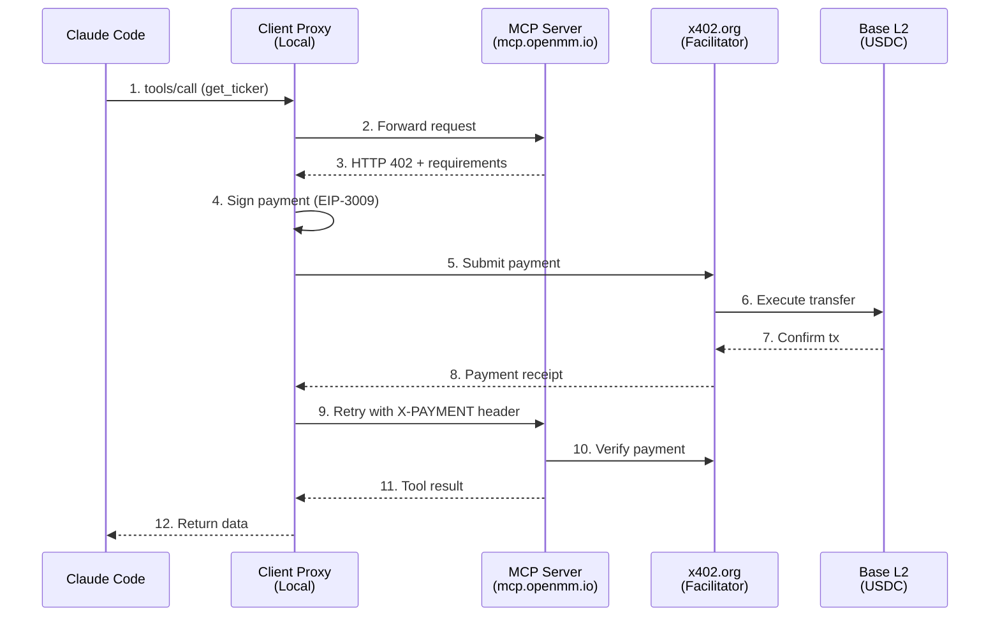

# @qbtlabs/x402

Multi-chain payment protocol for AI agents. Enable pay-per-call monetization for MCP servers with automatic USDC micropayments on Base.

[](https://www.npmjs.com/package/@qbtlabs/x402)
[](https://opensource.org/licenses/MIT)

## Architecture

The x402 payment system uses a three-layer proxy architecture:



### Three-Layer Model

| Layer | Component | Role |
|-------|-----------|------|
| **Client** | `npx @qbtlabs/x402 client-proxy` | Intercepts 402s, signs payments, retries |
| **Server** | `withX402Server()` middleware | Returns 402s, verifies payments, settles |
| **Facilitator** | x402.org | Executes on-chain transfers |

## Features

- **Client Proxy** — Automatic payment signing for Claude Code/Desktop
- **Server Middleware** — Payment gating with zero tool-level changes
- **Payment-Aware Fetch** — Drop-in replacement for `fetch()` with payment handling
- **Multi-Chain** — Base (USDC) with Solana support planned
- **Testnet Ready** — Base Sepolia for development

## Installation

```bash
npm install @qbtlabs/x402
```

## Quick Start: Client Side

### For Claude Code Users

Add to `~/.claude/mcp_servers.json`:

```json
{
  "mcpServers": {
    "openmm": {
      "command": "npx",
      "args": ["@qbtlabs/x402", "client-proxy", "--target", "https://mcp.openmm.io/mcp"],
      "env": {
        "X402_PRIVATE_KEY": "0xYOUR_PRIVATE_KEY"
      }
    }
  }
}
```

That's it! Claude Code will now automatically pay for tool calls.

### Programmatic Client Usage

```typescript
import { createPaymentFetch } from '@qbtlabs/x402';

// Create a payment-aware fetch function
const paymentFetch = createPaymentFetch({
  privateKey: process.env.X402_PRIVATE_KEY,
  chainId: 84532, // Base Sepolia
});

// Use like regular fetch — payments happen automatically
const response = await paymentFetch('https://mcp.openmm.io/mcp', {
  method: 'POST',
  headers: { 'Content-Type': 'application/json' },
  body: JSON.stringify({
    jsonrpc: '2.0',
    method: 'tools/call',
    params: { name: 'get_ticker', arguments: { exchange: 'mexc', symbol: 'BTC/USDT' } },
    id: 1,
  }),
});
```

## Quick Start: Server Side

### Cloudflare Worker with x402

```typescript
import { withX402Server, setToolPrices, configure } from '@qbtlabs/x402';

// Configure payment recipient
configure({
  evm: { address: process.env.X402_EVM_ADDRESS },
  testnet: process.env.X402_TESTNET === 'true',
});

// Set tool pricing
setToolPrices({
  list_exchanges: 'free',
  get_ticker: 'read',      // $0.001
  get_orderbook: 'read',   // $0.001
  place_order: 'write',    // $0.01
});

// Your MCP request handler
async function handleMcpRequest(request: Request): Promise<Response> {
  const body = await request.json();
  // ... handle MCP JSON-RPC
  return Response.json({ jsonrpc: '2.0', id: body.id, result: { /* ... */ } });
}

// Wrap with x402 payment gating
export default {
  fetch: withX402Server({
    handler: handleMcpRequest,
  }),
};
```

The middleware automatically:
- Passes free tools and non-tool requests through
- Returns 402 with payment requirements for paid tools
- Verifies payments via the facilitator
- Settles payments after successful execution

## API Reference

### Configuration

```typescript
import { configure, setToolPrices } from '@qbtlabs/x402';

// Configure payment settings
configure({
  evm: { address: '0x...' },        // Your USDC receiving address
  solana: { address: 'So...' },     // Optional: Solana address
  testnet: true,                     // Use Base Sepolia
  facilitatorUrl: 'https://x402.org', // Default facilitator
});

// Set pricing for tools
setToolPrices({
  'tool_name': 'free',      // $0
  'tool_name': 'read',      // $0.001
  'tool_name': 'analysis',  // $0.005
  'tool_name': 'write',     // $0.01
  'tool_name': 0.05,        // Custom price in USD
});
```

### Transport Layer

#### `createPaymentFetch(options)`

Creates a fetch function that automatically handles 402 responses.

```typescript
import { createPaymentFetch } from '@qbtlabs/x402';

const paymentFetch = createPaymentFetch({
  privateKey: '0x...',    // Wallet private key
  chainId: 84532,         // Chain ID (84532 = Base Sepolia, 8453 = Base)
});

const response = await paymentFetch(url, options);
```

#### `withX402Server(options)`

Middleware that wraps a request handler with payment gating.

```typescript
import { withX402Server } from '@qbtlabs/x402';

const handler = withX402Server({
  handler: async (request: Request) => Response,
  extractToolName: (body: unknown) => string | null,  // Optional custom extractor
});
```

### Proxy Layer

#### `createClientProxy(options)`

Creates a stdio-to-HTTP proxy with payment handling.

```typescript
import { createClientProxy } from '@qbtlabs/x402';

const proxy = createClientProxy({
  targetUrl: 'https://mcp.openmm.io/mcp',
  privateKey: '0x...',
  chainId: 84532,
});

await proxy.start();
```

#### `createPassthroughProxy(options)`

Creates a full MCP passthrough proxy.

```typescript
import { createPassthroughProxy } from '@qbtlabs/x402';

await createPassthroughProxy({
  targetUrl: 'https://mcp.openmm.io/mcp',
  privateKey: '0x...',
  mode: 'stdio',
});
```

### Client Utilities

```typescript
import { signPayment, buildPaymentPayload, parsePaymentRequired } from '@qbtlabs/x402';

// Parse 402 response
const requirements = parsePaymentRequired(response);

// Sign a payment
const signature = await signPayment({
  privateKey: '0x...',
  to: requirements.payTo,
  value: requirements.maxAmountRequired,
  chainId: 84532,
});

// Build the X-PAYMENT header value
const paymentHeader = buildPaymentPayload(signature, requirements);
```

### Facilitator Integration

```typescript
import {
  buildFacilitatorRequirements,
  verifyWithFacilitator,
  settleWithFacilitator,
} from '@qbtlabs/x402';

// Build 402 response requirements
const requirements = buildFacilitatorRequirements('get_ticker');

// Verify a payment
const result = await verifyWithFacilitator(paymentPayload, 'get_ticker');

// Settle after execution
await settleWithFacilitator(paymentPayload, 'get_ticker');
```

## Package Structure

```
src/
├── index.ts              # Main exports
├── config.ts             # Configuration (addresses, testnet)
├── pricing.ts            # Tool pricing tiers
├── verify.ts             # Payment verification
├── client.ts             # Client-side signing
├── facilitator.ts        # x402.org integration
├── chains/
│   ├── evm.ts            # EVM/Base utilities
│   └── solana.ts         # Solana utilities (planned)
├── transport/
│   ├── payment-fetch.ts  # Payment-aware fetch
│   └── server.ts         # Server middleware
├── proxy/
│   ├── client-proxy.ts   # Client proxy factory
│   └── passthrough.ts    # MCP passthrough proxy
├── middleware/
│   └── mcp.ts            # Legacy tool-level middleware
└── scripts/
    └── client-proxy.ts   # CLI entry point
```

## Environment Variables

### Client Side

| Variable | Description | Required |
|----------|-------------|----------|
| `X402_PRIVATE_KEY` | Wallet private key for signing payments | Yes |
| `X402_CHAIN_ID` | Chain ID (84532=Sepolia, 8453=Mainnet) | No (default: 84532) |

### Server Side

| Variable | Description | Required |
|----------|-------------|----------|
| `X402_EVM_ADDRESS` | USDC receiving wallet address | Yes |
| `X402_TESTNET` | Use testnet (Base Sepolia) | No (default: false) |
| `X402_FACILITATOR_URL` | Custom facilitator URL | No |

## Pricing Tiers

| Tier | Price | Use Case |
|------|-------|----------|
| `free` | $0.00 | Discovery, listing |
| `read` | $0.001 | Market data, queries |
| `analysis` | $0.005 | Computed insights |
| `write` | $0.01 | Transactions, mutations |

## Networks

| Network | Chain ID | USDC Contract |
|---------|----------|---------------|
| Base Sepolia | 84532 | `0x036CbD53842c5426634e7929541eC2318f3dCF7e` |
| Base Mainnet | 8453 | `0x833589fCD6eDb6E08f4c7C32D4f71b54bdA02913` |

## Related Projects

- [openmm-mcp](https://github.com/QBT-Labs/openmm-mcp) — MCP server using x402
- [x402 Protocol](https://x402.org) — Payment facilitator
- [MCP SDK](https://github.com/modelcontextprotocol/sdk) — Model Context Protocol

## License

MIT © QBT Labs
